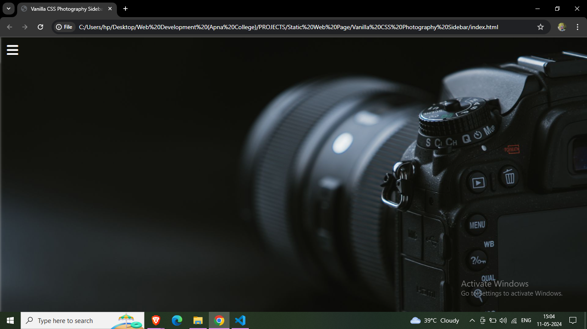

# PixelPerfect: Photography Sidebar Menu - Vanilla CSS 

PixelPerfect is a mini project showcasing a sidebar menu created using only HTML and vanilla CSS. It is specifically designed for use in photography websites to provide easy navigation and enhance user experience.

## Features

- **Pure CSS:** The sidebar menu is created using only HTML and vanilla CSS, making it lightweight and easy to integrate into any project.
- **Smooth Transitions:** Smooth transition effects are incorporated to enhance user interaction and provide a polished look and feel.
- **Hover Effects:** Interactive hover effects are implemented to improve usability and highlight menu items when hovered over.

## Screenshots

